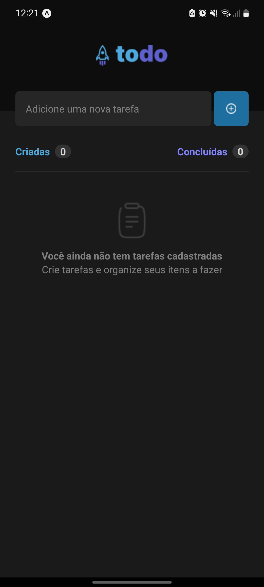
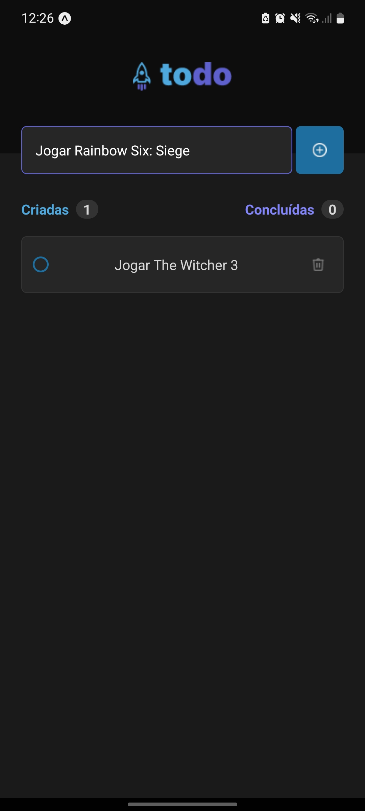
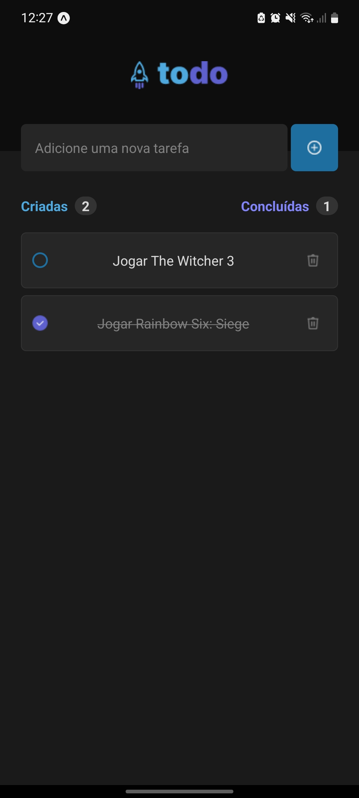
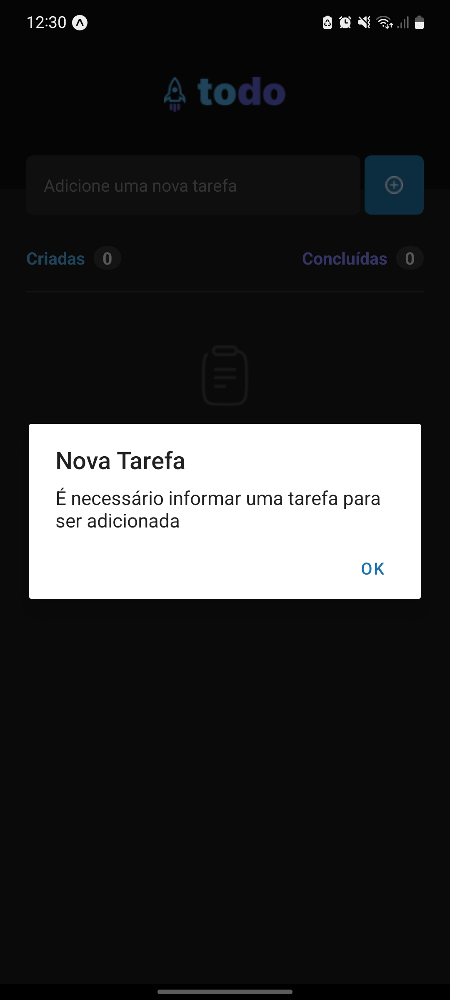

# ToDo List - Ignite | Rocketseat

## Português

#### Aplicativo de lista de tarefas

A aplicação foi desenvolvida em React Native com Expo utilizando o design disponibilizado através do Figma. Nela o usuário pode cadastrar, excluir tarefas e marcá-las como concluída.

## English

#### Task list application

The application was developed in React Native with Expo using the design made available through Figma. In it the user can register, delete tasks and mark them as complete.

## Screenshots

    

        
        
        
        
    

## Video

https://user-images.githubusercontent.com/86618257/201671744-46f6fd24-0883-481f-8b05-80715bfed2fb.mp4

## Stack

 
